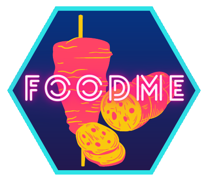

# FooDMe - A pipeline for Food DNA Metabarcoding 

FooDMe is a reproducible and scalable snakemake workflow for the analysis of 
DNA metabarcoding experiments, with a special focus on food and feed samples.

## Usage 

The documentation for this hosted on our [homepage](https://cvua-rrw.github.io/FooDMe/).
If you use this workflow for research, you can cite this repo using the DOI above.

This workflow support snakemake´s standardized usage and is referenced in the 
[snakemake workflows catalog](https://snakemake.github.io/snakemake-workflow-catalog/).

