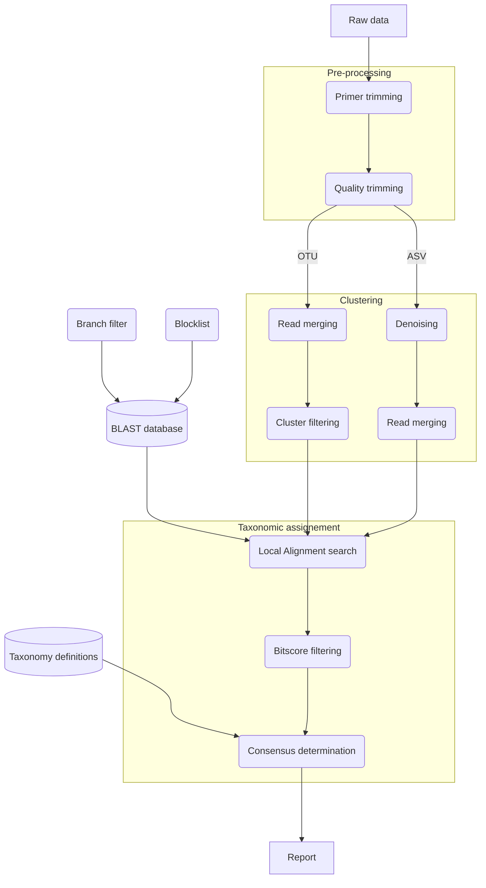

# Overview

Welcome to the User Manual of FooDMe.
This documentation will guide you through your first steps with the pipeline.

## Aim

The aim of this workflow is the taxonomic assignement of paired-end Illumina amplicon sequencing reads.
It was developped with a focus of food and feed authenticity control.

## Workflow description

The workflow consists of three main steps that will be performed sequentially: reads pre-processing,
clustering, and taxonomic assignment.

### Input data

The pipeline expects paired-end Illumina reads, provided as paths in a tabular file.
See the [configuration help](configuration.md) for more details.

### Pre-processing

As a first analysis step, primers will be trimmed from the reads. By default primers are only matched on 
the 5' end of the reads. In some cases (e.g. Sequencing is longer than the amplicon length) one may want
to trim primers on the 3' end as well. This behaviour is supported and can be enabled in the [parameters](configuration.md). 

The reads will then be pre-processed for quality trimming on the 3' end using a sliding window checking for minimal 
quality requirements.

### Clustering

FooDMe implements three different clustering strategies to choose from. Each has specific performances
that can be better suited to your specific needs.

#### Identity clustering

For this strategy, sequences are first dereplicated and ranked by abundance.
Each sequence is then compaired to an itinially empty list of centroids and, 
based on sequence similarity, is either assigned as a new centroid or merged with 
the most similar existing centroid.

The degree of identity required for clustering the sequences can be freely set, 0.97 
being a commonly accepted value and 1.0 corresponding to a dereplication.

This approach is very good at smoothing out seqencing noise but can also result
in the clustering of highly similar sequences for different organisms.

#### Dereplication

With this strategy, only identical reads will be clustered together.
This is effectively implemented as an identity clustering strategy with 100% identity.
This is more suitable for high sensitivity identification of amplicons but
the sequencing noise will not be filtered.

Due to the large number of clusters resulting from this strategy this is also the most 
computationally expensive of the three.

#### Denoising

For the denoising strategy, the nucleotide substitution rate of the sequencing run 
will be modelled based on the available data. Using this model, reads can be corrected 
for sequencing-induced substitutions. This results in a typically low number of cluster, 
close to the biological reality of the sample.

!!! note

    Clusters are often refered to as Operational Taxonomic Units (OTUs) for
    dereplication and identity clustering and as Amplicon Sequence Variants (ASVs) for
    denoising.

### Taxonomic assignment

#### BLAST search and filtering

The representative sequences for each cluster are compaired to a user-provided nucleotide
database using Basic Local Alignment Search (BLAST) and references satisfying specified 
similarity critera are recovered.

In most cases, only part of the database is relevant for each application. For this purpose it is 
possible to specify a taxonomic node (for example Vertebrates) to which to limit the BLAST search.

Specific taxa can also be irrelevant, such as common contaminants or extinct species. This taxa can
be provided as a list of identifiers in a text file and will be filtered out of the BLAST search.

!!! info

    We use the NCBI Taxonomy nomenclature, including lineages and identifiers.
    See [https://www.ncbi.nlm.nih.gov/taxonomy](https://www.ncbi.nlm.nih.gov/taxonomy) for more details.

Because this typically results in a large number of matching results (and taxa), the matches 
can be post-filtered based on their alignment quality as measured by the alignement bit-scores.

#### Taxonomic consensus

As this process often results in a unclear mix of taxa, a consensus can be determined based 
on the underlying taxonomic hierachy and a minimal agreement level that can be freely set
between strict majority (0.51) and last-common ancestor (1.0).

### Ouput

Statistics on the results of each processing steps as well as the final results with the 
composition of each samples are saved in tabular files and in an HTML report whose tables
can be exported to popular formats such as Excel or PDF. More info [here](results.md).

## Workflow chart

Below is a schematical overview of the data processing:

